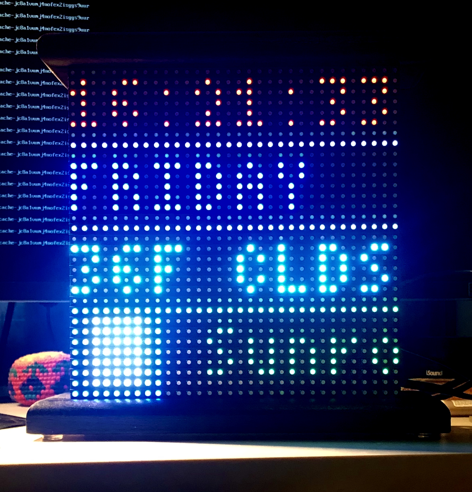

# rPi Daily Display w/ Spotify

For the longest time I've had a Raspberry Pi and this 32x32 billboard display sitting on my shelf. I finally decided to make daily info display to bring back to my dorm room. The entire setup is fairly simply:

## Features:

- **Live clock (Hours, minutes, seconds)**
	- Clock is red in the PM and blue in the AM
- **Weekday**
	- Each weekday is assigned its own color
- **Weather**
	- Weather is fetched from Open Weather Map every 10 seconds
	- Main condition is condensed to 4 characters (RAIN, CLDS, THDR)
	- Condition dictates color of text
- **Spotify Display**
	- Current user's now playing is polled every 10 seconds
	- If track is found the album art is displayed in a 9x9 box and the track title scrolls by
- **Urban Dictionary WOTD**
	- Shown when no playing Spotify track is found

## Hardware

- [Raspberry Pi 3b](https://www.raspberrypi.org/products/raspberry-pi-3-model-b/)
- [Adafruit RGB Matrix HAT + RTC for Raspberry Pi](https://learn.adafruit.com/adafruit-rgb-matrix-plus-real-time-clock-hat-for-raspberry-pi)
- [Adafruit 32x32 RGB LED Matrix Panel](https://www.adafruit.com/product/607)

The entire setup cost approximately $100 and took only a couple hours to put together. I recommend following [Adafruit's incredible product guide to put it all together.](https://learn.adafruit.com/adafruit-rgb-matrix-plus-real-time-clock-hat-for-raspberry-pi)

## Software

- Drawing code utilizes Python binds of [hzeller's rpi-rgb-led-matrix](https://github.com/hzeller/rpi-rgb-led-matrix)
- Urban Dictionary Word of the Day is fetch from [flebel's Micro-REST API](https://github.com/flebel/urban-word-of-the-day)
- [Spotipy for Spotify integrations](https://github.com/plamere/spotipy)

## Installation

1. Download to your computer (Not rPi)
2. Update `config.py` with your *Spotify Web API* credentials and *OpenWeatherMap* `appid`
3. Run `python util.py` follow steps to login to Spotify
4. Move entire installation to rPi
5. Run `main.py` your display should display all information listed in the features. If not make you have installed all necessary modules.
6. [Add `main.py` and `network-monitor.sh` to /etc/profile so they run on boot](https://www.raspberrypi-spy.co.uk/2015/02/how-to-autorun-a-python-script-on-raspberry-pi-boot/)
7. Done!
